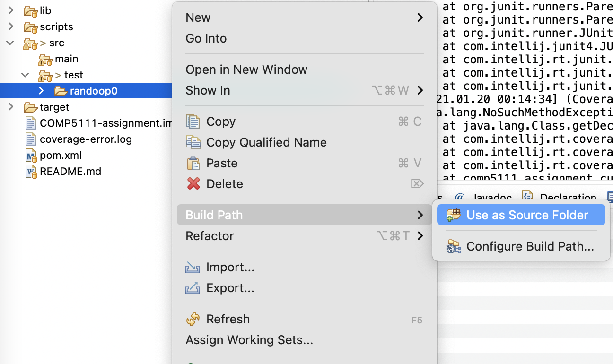
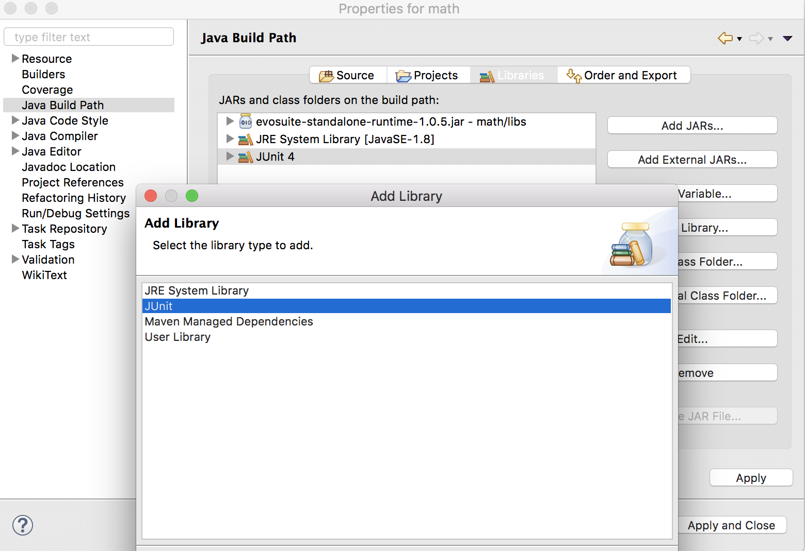

# Random Testing with Randoop

 

## Introduction

In this tutorial, you will learn how to use the random testing tool Randoop. Randoop is an automatic unit test generator for Java programs. It generates two types of test suites: 

- Error-revealing tests that indicates errors in the Java code.
- Regression tests that capture current behavior of the program.

## Steps

You can follow these steps to use Randoop to generate test cases.

 

### **1. Install Randoop**

We have already prepared the target version: Randoop-4.2.7 `jar` file in [lib](../lib) and you do not need to do anything on the installation.

In case you want to manually install the Randoop, please refer to the [official guide of Randoop](https://randoop.github.io/randoop/manual/#getting_randoop) and choose the target version: `randoop-all-4.2.7.jar`

Please Note the subtle differences to set environment variables on Windows and Unix-based systems.

 

### **2. Generate Test Cases**

 

After setting up the environment for Randoop, generating junit test cases is as easy as a single line of command.

First of all, you need to download assignment 1 project, make sure the 
file`src/main/java/comp5111/assignment/cut/Subject.java` exists.

Then, you need to compile the `Subject` class. (In case you are not familiar with Java, here is a [tutorial](https://docs.oracle.com/javase/7/docs/technotes/tools/windows/classpath.html) to teach you how to use `java`/`javac` to compile the `.java` file to `.class` and how to configure the `classpath` when compiling)
Suppose the root dir of the project is `${ROOT_DIR}`, and the folder containing the java bytecode is `${TARGET}`, whose content should have `${TARGET}/comp5111/assignment/cut/Subject.class` file available.

To use Randoop to generate test cases for our class under test, you can use the following command:

Linux and MacOs version (bash): 
```
java -ea -classpath ${RANDOOP_JAR}:${TARGET}/ \
   randoop.main.Main gentests \
   --testclass=comp5111.assignment.cut.Subject \
   --time-limit=60 \
   --junit-package-name=comp5111.assignment.cut \
   --junit-output-dir=${ROOT_DIR}/src/test/randoop0
```

Windows version:

```
java -ea -classpath %RANDOOP_JAR%;%TARGET% randoop.main.Main gentests --testclass=comp5111.assignment.cut.Subject --time-limit=60 --junit-package-name=comp5111.assignment.cut --junit-output-dir=%ROOT_DIR%/src/test/randoop0
```
Windows users are recommend to use `Powershell` instead of `Command Prompt`, and replace the `environment variables` in the command with `relative path`. 

Note: The randoop parameters used in the command

`gentest`: Generate test using Randoop

`--testclass`: The class under test

`--timelimit`: The time limit for test case generation (in seconds)

`--junit-package-name`: The package name of the generated test cases

`--junit-output-dir`: The output directory name of the generated test cases

You can customize your own options when running Randoop. More options could be found on [Randoop Manual](https://randoop.github.io/randoop/manual/#customize). 
You can use the given parameters or use your customized parameters. However, the generated test cases should be able to cover most statements/branches.

Please note that all the test cases you generate should be located in `${ROOT_DIR}/src/test` folder.

**The test cases generated by you should be similar to this [example](../src/test/example_test).**

### **3. View and Run the Generated Test Cases**

After the previous step, there should be test cases generated in the specified output directory (“test” in the example).

To run the tests using Eclipse, you need to (You can also refer to the [demo video](https://drive.google.com/file/d/1DZAGe0WpumKhFayyKqE2bDjnS3t9D42i/view?usp=sharing)):

1. Add folder containing randoop generated test suite (e.g. `randoop0`) to the **Build Path**



2. Add JUnit 4 to the **project dependencies**

   a.     Right click the project

   b.     Select *Properties*

   c.     Select *Java Build Path*

   d.     Select *Libraries*

   e.     Click *Add Library…*

   f.      Select *JUnit*

   g.     Select *JUnit 4*





3. **Run** the generated test cases and measure the coverage

   a.     Right click the test suite class generated by Randoop

   b.     Select *Coverage as* ® *JUnit Test*

 

 

 
